নাম্বার থিওরীর বেশ মজার একটি টপিকস হলো ইউলার ফাই ফাংশন। নাম্বার থিওরী রিলেটেড প্রবলেম সলভ করতে গেলে দেখবে প্রায়ই এটি খুব কাজে লাগছে। ইউলার ফাই ফাংশন খুবই সহজ একটি কনসেপ্ট। একটি সীমার মাঝে কয়টি রিলেটিভলি প্রাইম আছে সেটা খুজে বের করাই এর কাজ। ইউলার ফাইয়ের সবচে মজার পার্ট হলো এর বেশ কিছু ইন্টারেস্টিং প্রপার্টিজ আছে আর সিভ অফ এরাটস্থেনিজ এলগরিদম জানা থাকলে এর কোডিং করাটাও বেশ ইজি। ইউলার ফাই বা ইউলার টশিয়েন্ট ফাই মূলত একটি ফর্মুলা। লেখাটির পুরো অংশ জুড়ে আমরা ঐ ফর্মুলাটি বুঝার চেষ্টা করবো। ফর্মুলাটি হলো –

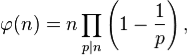

**ইউলার ফাই ফাংশনের কাজ হলো একটি সংখ্যার জন্য ঐ সংখ্যার চেয়ে ছোট অথবা সমান যেসব সংখ্যাগুলো রিলেটেভলি প্রাইম সেগুলোকে খুঁজে বের করা।** একটি সংখ্যার কতগুলো রিলেটিভলি প্রাইম আছে সেটা বের করাই এর কাজ। এটাকে গ্রিক বর্ণ ফাই দিয়ে প্রকাশ করা হয় – φ(n) orϕ(n)। আরেকটু গানিতিকভাবে বললে, 0&lt;k&lt;=n রেঞ্জের মাঝে যেসব পূর্ণসংখ্যার গসাগু (Greatest Common Divisor) gcd(n, k) = 1 তারাই হলো ইউলার টশিয়েন্ট ফাংশনের উপাদান। উপরের লাইন দুটো পড়ে তুমি নিশ্চয়ই একটা ব্যাপার ধরে ফেলেছো যে রিলেটিভলি প্রাইম হলো সেসব সংখ্যা যাদের গসাগু’র মান হলো 1। এদেরকে কোপ্রাইমও বলা হয়। 

যেমন, n = 9 এর জন্য কোপ্রাইম বা রিলেটিভলি প্রাইম হলো ছ’টি – 1, 2, 4, 5, 7 আর 8। বাকি তিনটি সংখ্যা 3, 6 এবং 9 রিলেটিভলি প্রাইম না কারণ gcd(9, 3) = gcd(9, 6) = 3 ও gcd(9, 9) = 9। 

ইউলার ফাংশনের কিছু প্রপাটিজঃ

১. 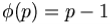 হবে, যদি p প্রাইম হয়, কারণ যেসব সংখ্যা p এর চেয়ে ছোটো সেগুলো অবশ্যই p এর রিলেটিভলি প্রাইম হবে। উদাহরণস্বরূপঃ প্রাইম সংখ্যা ১১ এর জন্য ইউলার পাইয়ের মান ১১-১ = ১০ হবে। খাতায় gcd(n, 1..n-1) এর মান বের করো দেখো সবার জন্য ফলাফল ১ আসবে।

২. যদি 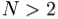 হয় তাহলে একটি জোড় সংখ্যাহবে, যদি k,N এর রিলেটিভলি প্রাইম হয়, তাহলে N–k ও রিলেটিভলি প্রাইম হবে এবং N আর N-k মান দুটো আলাদা সংখ্যা।

৩.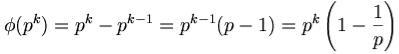, এই ফর্মুলার অর্থ হলো – থেকেএর মাঝে যেসব সঙ্খ্যাগুলো 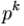এর রিলেটিভলি প্রাইম না, তারা অবশ্যই p দ্বারা বিভাজ্য হবে এবং  এই ধরণের সংখ্যা পাওয়া যাবে – 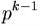 টি। ইউলার ফাই ফাংশনের মাল্টিপ্লিকেটিভ বৈশিষ্ট্য থাকায় এই ফর্মুলা থেকে 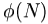 এর জন্য নতুন একটি মাল্টিপ্লিকেটিভ ফর্মুলা দাঁড় করানো যায়।

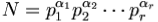  যদি N এর প্রাইম ফ্যাক্টরাইজেশন হয়, তাহলে আমরা লিখতে পারি –

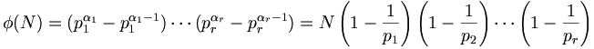

যেখানে – প্রত্যেক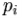হচ্ছে ভিন্ন ভিন্ন প্রাইম নাম্বার আর প্রত্যেকএকটি পূর্ণসংখ্যা।

উপরের ফর্মুলাটি হাতে-কলমে ম্যানিপুলেট করার চেষ্টা করা যাক। উদাহরণস্বরুপ 36 এর ইউলার ফাংশন নিচ্ছি।

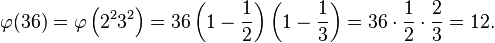

আমরা জানি, 36 এর মৌলিক প্রাইম ফ্যাক্টর হল – 2 ও 3। ৩৬ এর প্রাইম ফ্যাক্টরাইজেশন করলে দাঁড়ায় – ৩৬ = ২^২ \* ৩^২। একটু লক্ষ করলে বুঝতে পারবে – 1 থেকে 36 পর্যন্ত অর্ধেক সংখ্যক ইন্টিজার 2 দ্বারা এবং এক তৃতীয়াংশ সংখ্যা 3 দ্বারা নিঃশেষে বিভাজ্য হবে । ফর্মুলা থেকে  – ৩৬\*(১/২)\*(২/৩) = ১২ টি সংখ্যা পাওয়া যায় যেগুলো ৩৬ এর কোপ্রাইম।তাহলে আমরা মোট সংখ্যা পেলাম যারা প্রকৃতপক্ষে এর কোপ্রাইম এবং সংখ্যাগুলি হলো 1, 5, 7, 11, 13, 17, 19, 23, 25, 29, 31, এবং 35 উপ ফর্মুলাকে কাজে লাগিয়ে ইউলাই পাই ফাংশনের কোড লেখা হয়েছে। কোডিং করার ক্ষেত্রে প্রাইমারিলিটি টেস্টিং এলগরিদম **সিভ অফ এরাটস্থেনিজ** জানা থাকা জরুরি। সিভ অব এরাটস্থেনিজ এর কোডকে মডিফিকেশন করেই ইউলার ফাই ফাংশন লেখা হয়েছে। আরো দুয়েকটি উপায়ে এর কোড করা সম্ভব, তবে এ উপায়টি বুঝতে খুবই সহজ। সিভ অফ এরাটস্থেনিজ জানা না থাকলে গুগল করে বুঝে নিতে পারো। সিভ অব এরাটস্থেনিজের দিয়ে আমরা প্রাইমগুলো চেক করছি এবং ফর্মুলা অনুযায়ী নিচের কোডে res = res – (res/p) তে ফলাফল কাউন্ট করা হচ্ছে।

**রেফারেন্স লিঙ্কঃ**
1. [Euler’s Phi function, Algorithmist ](http://www.algorithmist.com/index.php/Euler's_Phi_function)
2. [Euler’s Totient Function (or Euler Phi)](https://imranshabijabi.wordpress.com/2012/11/14/eulers-totient-function-or-euler-phi/)
3. [Fast Euler Totient Function in C++](http://abhisharlives.blogspot.com/2013/03/euler-totient-function-in-3-ways.html)

**রিলেটেড প্রবলেম টু সলভঃ**

1. [UVA 10179 Irreducible Basic Fractions](http://uva.onlinejudge.org/index.php?option=onlinejudge&page=show_problem&problem=1120)
2. [UVA 10299 Relatives](http://uva.onlinejudge.org/index.php?option=onlinejudge&page=show_problem&problem=1240)
3. [UVA 11327 Enumerating Rational Numbers](http://uva.onlinejudge.org/index.php?option=com_onlinejudge&Itemid=8&page=show_problem&problem=2302)
4. [TMUS 1673 admission exam](http://acm.timus.ru/problem.aspx?space=1&num=1673)
5. <https://www.spoj.com/problems/ETF/>
6. <https://www.spoj.com/problems/DCEPCA03/>
7. <http://codeforces.com/contest/284/problem/A>